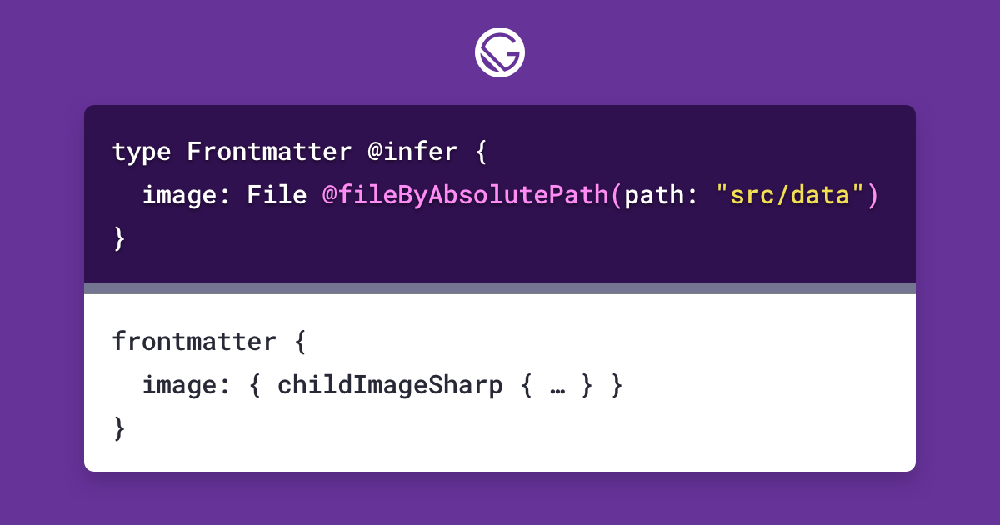

# gatsby-schema-field-absolute-path



This plugin resolves absolute path (i.e `content/assets`) to the correct File node in your Gatsby graphql schema.

For example, if you have a content structure like this

```
root
  |--content
  |     |--posts
  |     |   `--hello-world.md
  |     `--assets
  |         `--cat.jpg
  |--src
  |--gatsby-config.js
 ...
```

And in `hello-world.md`, you have this frontmatter

```md
---
slug: hello-word
featuredImage: assets/cat.jpg
---

What a nice day!
```

This plugin will resolve `assets/cat.jpg` to a File node instead of a string, so you can query the image as expected:

```gql
query PostContent {
  frontmatter {
    featuredImage {
      childImageSharp {
        fluid(maxWidth: 1280) {
          ...gatsbyImageSharpFluid
        }
      }
    }
  }
}
```

Of course this is not done by magic, you'd have to add the generated field extension to your field via `createTypes` in `gatsby-node.js`.

```js
// gatsby-node.js

exports.createSchemaCustomization = ({ actions }) => {
  const { createTypes } = actions

  // @fileByDataPath and @fileByAbsolutePath are 
  // field extensions generated by this plugin
  const typeDefs = `
    type Frontmatter @infer {
      attachment: File @fileByAbsolutePath(path: "content/attachment")
    }

    ${ /* alternatively */ }    
    type Frontmatter @infer {
      featureImage: File @fileByDataPath
    }

    type MarkdownRemark implements Node @infer {
      frontmatter: Frontmatter
    }
  `

  createTypes(typeDefs)
}
```

### How It Works

I published a post on how this work over here: [link](https://www.byderek.com/post/a-stackoverflow-question--a-use-case-for-gatsbys-field-extension)

### Usage

#### Install
```sh
yarn add gatsby-schema-field-absolute-path

# or
npm i gatsby-schema-field-absolute-path
```

#### Add to Gatsby config

```js
// gatsby-config.js

module.exports = {
  plugins: [
    // 1. No custom dirs
    'gatsby-schema-field-absolute-path',
    // 2. With custom dirs:
    {
      resolve: 'gatsby-schema-field-absolute-path',
      options: {
        // a. single directory
        dirs: 'content/assets'

        // b. array of directories
        dirs: ['content/assets', 'src/processed/images']

        // or c. object with named field extension
        dirs: {
          'content/assets': 'fileByAssetPath',
          'src/processed/images': 'fileByImagePath',
        }
      }
    }
  ]
}

```


#### Specify target fields

```js
// gatsby-node.js

exports.createSchemaCustomization = ({ actions }) => {
  const { createTypes } = actions

  const typeDefs = `
    type Frontmatter @infer {

      ${/* without configuration */}
      featureImage: File @fileByAbsolutePath(path: "content/asset")
      
      ${/* or with configuration */}
      featureImage: File @fileByAssetPath
    }

    type MarkdownRemark implements Node @infer {
      frontmatter: Frontmatter
    }
  `

  createTypes(typeDefs)
}
```

### How to Use

By default, this plugin create a generic field extension called `fileByAbsolutePath`. It accepts a `path` arguments, which allow finding file relative to the directory root:

```
root
  |--content
  |     |--posts
  |     |   `--hello-world.md
  |     `--assets
  |         `--cat.jpg
  |--src
  |--gatsby-config.js
 ...
```

```js
`
  type Frontmatter @infer {
    featuredImage: File @fileByAbsolutePath(path: "content/assets")
  }
`
```

---

You may also specify an option `dirs`, which accepts a string, an array of string, or an object. This plugin can generate multiple field extensions each targeting a specific directory, saving you some keystrokes if you have a lot of fields targeting files in different directories.

```ts
type Path = string
type FieldExtensionName = string

interface Options {
  dirs: Path | Path[] | Record<Path, FieldExtensionName>
}
```

- The path must be relative to your root directory. For example, `src` / `/src` / `./src` will all resolve to `<project root>/src`.
- The field extension name is generated automatically by the directory:

| directory | generated field extension name |
|---|---|
| `content/posts` | `pathByPostsPath` |
| `content/assets` | `pathByAssetsPath` |

If you're unsure what the generated name maybe, this plugin will tell you in development:
```
info gatsby-plugin-file-absolute-path: Field extension created! Use @fileByDataPath for 'src/data'
```

- If you pass an object to `dir`, you can specify the field extension name instead of generated one:

```js
// option
dirs: { 'content/assets': 'myFieldExtensionName' }

// usage
`
  type Frontmatter @infer {
    featuredImage: File @myFieldExtensionName
  }
`
```

---